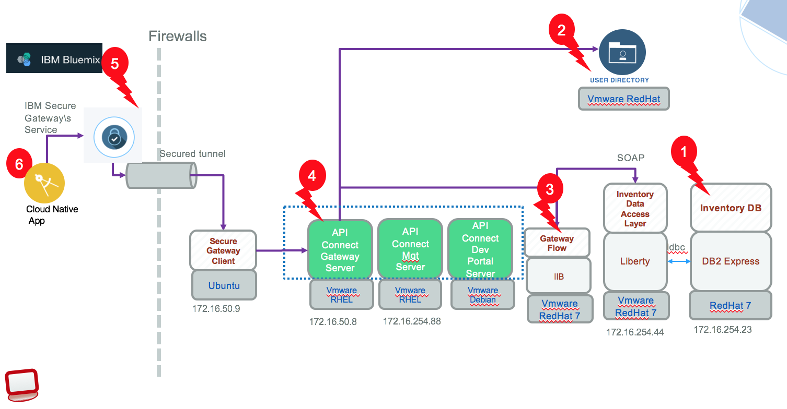

# Hybrid Integration Tests
This project is part of the 'IBM Integration Reference Architecture' suite, available at [https://github.com/ibm-cloud-architecture/refarch-integration](https://github.com/ibm-cloud-architecture/refarch-integration)

The goal of this test project, is to validate the different components of the hybrid integration architecture at the interface level, and build a suite of test cases for non-regression test. The project can be deployed to a build server and tests executed automatically once all the dependent components are up and running on their own environment. When a test fails, developer should be able to quickly react. Issue could be linked to a service interface contract change, or a behavioral changes identifiable at the consumer level.

The components tested are :
* [DB2 inventory database](#db2-validation)
* [Data Access Layer - JAXWS application](#dal-validation)
* [IIB gateway flow](#iib-gateway-flow)
* [API Connect - Exposed RESTful API](#api-gateway-validation)
* [Secure Gateway proxy](##secure-gateway-on-bluemix-validation)
* REST API of the [Case Inc Portal back end](#portal) for front end for the Bluemix app.

We can support different configuration depending of the deployment strategy selected. We have presented the different configurations for deploying the component of the solution to IBM Cloud Private in [this note](). Testing will be at the interface level but end point will differ depending of the deployment.

This first figure illustrates an hybrid public cloud - on-premise with the different integration test targets:  


While the following figure illustrates the same targets with one of the potential ICP configuration:


# Test Driven development
The development approach used for the hybrid integration validation is a test driven development practice where unit tests are developed before code, and then each deployed component is tested in isolation and then as a pyramid testing: first back end component, then middle tier and then front end API.

The Java layer for the Data Access Layer is developed with a pure TDD practice. This testing  project is to test at the integration level, testcases are consumers of each service.

# Integration Tests
In this section we are detailing the tests defined in this current project and how to execute them.
## Test organization
Testcases are under the src/test/java. The src/main/java folder includes utility classes for testing, and generated classes by importing the SOAP web service for the DAL component using the `wsimport` tool. The src/test/java and src/test/node folders includes the test case definitions.

## DB2 Validation
The DB2 server validation are under the package db2.tests. It uses JPA entity manager to connect to the remote database server using the persistence.xml configuration in src/main/resources. This JPA configuration file specifies the class being used as Entity and specify the JDBC properties like database URL and user / password

```
<persistence-unit name="inventory" transaction-type="RESOURCE_LOCAL">
		<class>inventory.model.ItemEntity</class>
		<properties>
			<property name="javax.persistence.jdbc.url" value="jdbc:db2://---------:50000/INVDB:retrieveMessagesFromServerOnGetMessage=true;"/>
			<property name="javax.persistence.jdbc.user" value="DB2INST1"/>
			<property name="javax.persistence.jdbc.password" value="-----"/>
			<property name="javax.persistence.jdbc.driver" value="com.ibm.db2.jcc.DB2Driver"/>
```
A DB2 JDBC driver is available in the lib folder.

The heavy tests of the Data Access Object are done in the DAL project as unit test. The goal of the tests here is to validate the DB2 database are up and running, and accessible via JDBC. Doing more will enforce redeveloping a DAO layer in this test project which was already done in the DAL project.

Also as DB2 tables should not be accessed directly, but via the SOAP front end, the failure tests are done at the DAL project.

## DAL Validation
The goal of those tests are to access the data of the inventory database using the Data Access Layer component deploy on its app server. The tests are consumers of the SOAP exposed services. Using JAXWS tooling, the DAL web service is accessed via proxy java code created using the `wsimport` command. The script is `importDALWS.sh` performs the import from the deployed DAL on Liberty server and generates the java classes under src/main/java/inventory/ws.

This import tool should be run only when the SOAP interface contract changes. The DAL web service tests are under src/text/java package ws.tests

As of now the CRUD operations for the item are tested as well as fault reporting.

*When a test fails in this environment, developer should implement a similar tests in the [DAL project]() to debug and improve unit test coverage.*

## IIB Gateway flow

## API Gateway Validation
The goal of the testcases under src/test/java/api is to validate the API Connect API definition for the inventory, login.

Here is a simple test to get all the items of the inventory.
```Java
@Test
public void testGetItemsDirectAccessToAPIC() {
	APICclient client = new APICclient();
	try {
		String itemArray=client.executeGetMethod("csplab/sb/sample-inventory-api/items", null);
		System.out.println(itemArray);
	} catch (Exception e) {
		e.printStackTrace();
		Assert.fail();
	}
}
```
The test uses a wrapper class on top of Apache HTTP client to do the HTTP connection. As we are using SSL communication and the SSL certificate of the API Connect deployment is self certified, this wrapper call disables hostname verification when opening SSL socket. The code to do that is in the `init()` method of the APICclient.java class:
```Java
setHttpClient(HttpClients.custom().setSSLHostnameVerifier(NoopHostnameVerifier.INSTANCE).build());

```

## Secure gateway on bluemix Validation
As the Bluemix secure gateway has a public URL it is possible to validate the path IBM secure gateway on bluemix -> secure gateway client on premise server -> API Connect on premise server -> SOAP service -> DB2
The junit tests are under the package sgapi.tests. They can be run with gradle or within Eclipse IDE or from command line via the shell script named testGetItemsJunit.sh

For demonstration purpose it is possible to also use nodejs to do the same validation. The test is defined in src/test/node and uses the *request* module to fist call login to get the access token and then get items API. So the sequences is to perform:
* http GET on https://cap-sg-prd-5.integration.ibmcloud.com:16582/csplab/sb/sample-inventory-api/login?
* http GET on https://cap-sg-prd-5.integration.ibmcloud.com:16582/csplab/sb/sample-inventory-api/items

The shell script *testItemsOath.sh* executes this javascript. Be sure to have performed a *npm install* before running the nodejs tests.

## Portal

## Execute integration validation tests
The project uses gradle so the following command executes all the tests
```
./gradlew build
```

# References
[Test driven development introduction in IBM garage method](https://www.ibm.com/devops/method/content/code/practice_test_driven_development/)
